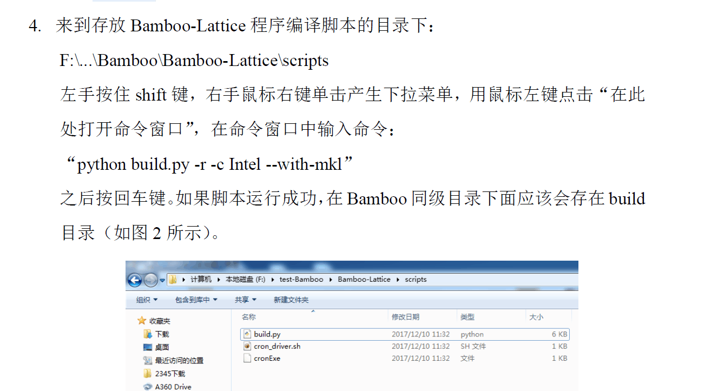
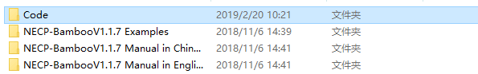
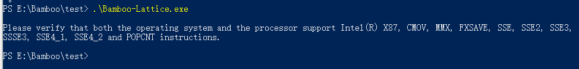

## 课程设计常见问题汇总

1. 报错：


使用Bamboo-Lattice的时候，需要先运行一个组件的主干卡片，其特点是文件名中含有`main`，
然后再运行分支卡片，其特点是文件名中含有`branch`。各个分支卡片的运行顺序没有特殊要求，
先跑哪个再跑哪个没有影响。

2. 报错：


首先确认输入卡片的`path`中指定的数据库的位置是否正确。当卡片中填写的路径如下时：
```xml
   <path>
       <WIMSNdir>E:\Bamboo\database\ENDF70.69\WIMSN\WIMSNdir.xml</WIMSNdir>
       <subdir>E:\Bamboo\database\ENDF70.69\LSQsub\LSQsubdir.xml</subdir>
       <DepFile>E:\Bamboo\database\DepFile\lavender.dat</DepFile>
   </path>
```
需要保证整个database文件夹存在于E:\Bamboo路径下。

然后需要确保database下的ENDF70.69文件夹中的三个子文件夹下的xml文件中有正确的路径。
WIMSN下面的WIMSNdir.xml，LSQsub下面的LSQsubdir.xml，
还有LSQIRsub下面的LSQsubdir.xml。这三个文件中均有一个`path`标签，需要确保每个文件
对应的`path`标签中应为该文件所在的文件夹路径。假如database在E:\Bamboo路径下，那么
这三个文件中的`path`分别如下：

```xml
<path>E:\Bamboo\database\ENDF70.69\WIMSN</path>
```

```xml
<path>E:\Bamboo\database\ENDF70.69\LSQsub</path>
```

```xml
<path>E:\Bamboo\database\ENDF70.69\LSQIRsub</path>
```

如果又出现了如下报错：


说明没有LSQsub中的xml文件没有改对，按照上面的说明再仔细改一遍。

3. 使用手册中的目录结构和实际的结构不一样

使用手册中说：



但是实际的目录结构并没有使用手册中的那些文件：



这个是因为使用手册中的这一段描述是针对源码的说明，用于课程设计的压缩包中不包含源码。

4. 报错：



这个问题一般会出现在AMD的CPU上，Bamboo-Lattice现无法在AMD的CPU上正常运行。
建议换台Intel的电脑运行。

5. Bamboo-Lattice的手动运行

使用Bamboo-Lattice针对一个组件进行计算时，先把Bamboo-Lattice的可执行程序和该组件的
主干卡放在一个文件夹中，将输入文件重命名为input.xml，然后在命令行中运行Bamboo-Lattice。
等它运行完毕后，把包含可执行程序、输入及输出的整个文件夹复制n份
（n为该组件的分支卡的数目）。再把各个分支卡分别复制到这些文件夹中，每个文件夹对应一个
分支卡，并把每个文件夹中的分支卡命名为input.xml，最后再在命令行中运行，可以同时
运行多个分支卡片。

6. Bamboo-Lattice的自动运行

参考Bamboo-Frame使用手册。
