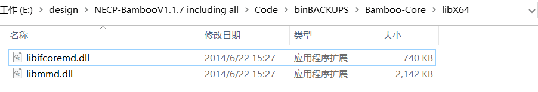
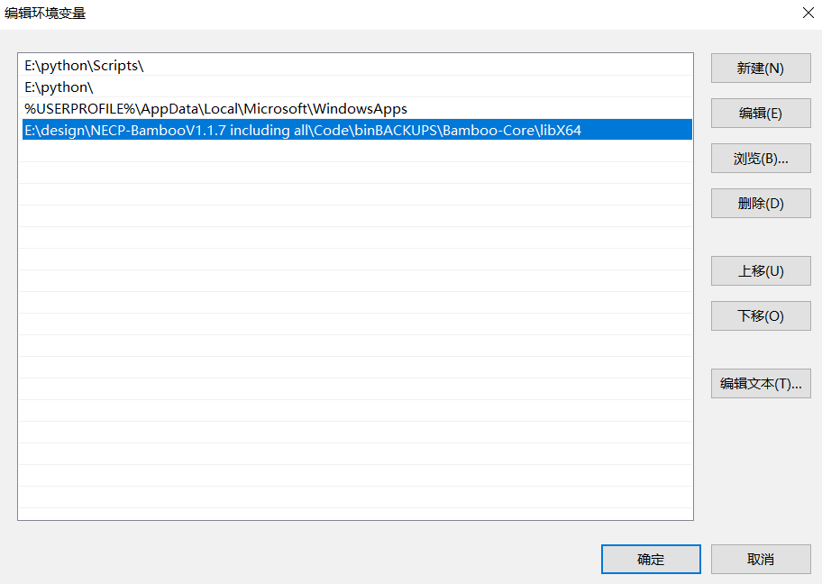

## 课程设计常见问题汇总

### 目录
- [第一部分](#第一部分)
- [第二部分](#第二部分)

### 第二部分
1. Visit和Python下载地址

[Visit](https://github.com/visit-dav/visit/releases/download/v3.0.2/visit3.0.2_x64.exe)

[Python](https://www.python.org/ftp/python/3.8.0/python-3.8.0-amd64.exe)

2. 运行

```
python bamboo generate input-C1.xml
python bamboo core 1
```

上面的命令指的是在input-C1.xml所在的目录下打开命令行窗口，输入上述命令运行。

3. 示例卡片运行报错

一般是在运行第二条命令的时候会报错，这是因为Bamboo-Core的运行需要一些dll文件。
这些文件可以在第一部分下载的文件中找到。例如：



找到之后，把该目录放在PATH环境变量中：



### 第一部分
1. 报错：


使用Bamboo-Lattice的时候，需要先运行一个组件的主干卡片，其特点是文件名中含有`main`，
然后再运行分支卡片，其特点是文件名中含有`branch`。各个分支卡片的运行顺序没有特殊要求，
先跑哪个再跑哪个没有影响。

2. 报错：


首先确认输入卡片的`path`中指定的数据库的位置是否正确。当卡片中填写的路径如下时：
```xml
   <path>
       <WIMSNdir>E:\Bamboo\database\ENDF70.69\WIMSN\WIMSNdir.xml</WIMSNdir>
       <subdir>E:\Bamboo\database\ENDF70.69\LSQsub\LSQsubdir.xml</subdir>
       <DepFile>E:\Bamboo\database\DepFile\lavender.dat</DepFile>
   </path>
```
需要保证整个database文件夹存在于E:\Bamboo路径下。

然后需要确保database下的ENDF70.69文件夹中的三个子文件夹下的xml文件中有正确的路径。
WIMSN下面的WIMSNdir.xml，LSQsub下面的LSQsubdir.xml，
还有LSQIRsub下面的LSQsubdir.xml。这三个文件中均有一个`path`标签，需要确保每个文件
对应的`path`标签中应为该文件所在的文件夹路径。假如database在E:\Bamboo路径下，那么
这三个文件中的`path`分别如下：

```xml
<path>E:\Bamboo\database\ENDF70.69\WIMSN</path>
```

```xml
<path>E:\Bamboo\database\ENDF70.69\LSQsub</path>
```

```xml
<path>E:\Bamboo\database\ENDF70.69\LSQIRsub</path>
```

如果又出现了如下报错：


说明没有LSQsub中的xml文件没有改对，按照上面的说明再仔细改一遍。

3. 使用手册中的目录结构和实际的结构不一样

使用手册中说：


但是实际的目录结构并没有使用手册中的那些文件：


这个是因为使用手册中的这一段描述是针对源码的说明，用于课程设计的压缩包中不包含源码。

4. 报错：


这个问题一般会出现在AMD的CPU上，Bamboo-Lattice现无法在AMD的CPU上正常运行。
建议换台Intel的电脑运行。

5. Bamboo-Lattice的手动运行

使用Bamboo-Lattice针对一个组件进行计算时，先把Bamboo-Lattice的可执行程序和该组件的
主干卡放在一个文件夹中，将输入文件重命名为input.xml，然后在命令行中运行Bamboo-Lattice。
等它运行完毕后，把包含可执行程序、输入及输出的整个文件夹复制n份
（n为该组件的分支卡的数目）。再把各个分支卡分别复制到这些文件夹中，每个文件夹对应一个
分支卡，并把每个文件夹中的分支卡命名为input.xml，最后再在命令行中运行，可以同时
运行多个分支卡片。

6. Bamboo-Lattice的自动运行

参考Bamboo-Frame使用手册。在使用Bamboo-Frame自动运行前，务必仔细检查每个输入文件，确保
其可以正常运行。因为使用Bamboo-Frame运行Bamboo-Lattice的时候，如果有单独的几个卡片
出错，它不会立即停止运行，而是等待其他没有问题的卡片运行结束后再显示哪些卡片运行出错。
